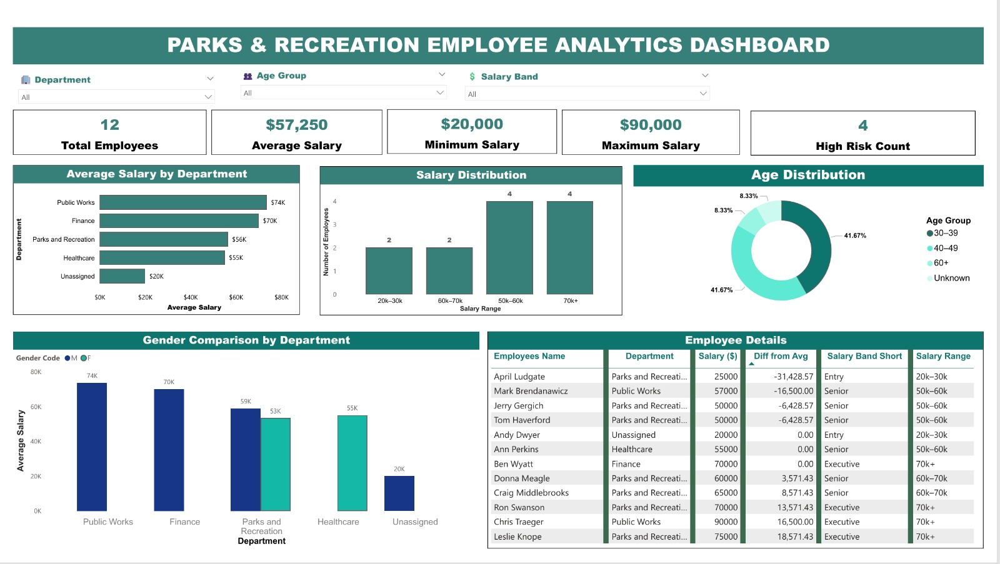

# Parks and Recreation Employee Analysis

## Project Overview

This project analyzes employee data from a Parks and Recreation organization to identify patterns in employee demographics, salaries, occupations, departments, and other workforce characteristics.

The analysis demonstrates the use of SQL for data exploration and transformation, alongside Power BI for interactive data visualization and dashboard development.

## Objectives

- Analyze employee demographics and workforce distribution.
- Examine salary patterns across departments and occupations.
- Compare individual salaries with departmental averages.
- Identify salary bands and employee age groups.
- Develop meaningful insights from the employee dataset.

## Tools Used

- MySQL
- Power BI
- DAX
- Microsoft Excel

## Skills Demonstrated

- Data Cleaning
- SQL Querying
- Data Analysis
- Data Transformation
- DAX Calculations
- Data Visualization
- Dashboard Development

## Key Areas of Analysis

The project explores employee age, gender, occupation, department, salary, salary bands, and differences between individual salaries and departmental salary averages.

## Project Status

Completed
## Power BI Dashboard

The dashboard provides an interactive view of employee demographics, salary patterns, departmental performance, gender distribution, and salary-related risk indicators.

## Key Insights

- The dataset contains 12 employees.
- The average employee salary is $57,250.
- The minimum salary is $20,000, while the maximum salary is $90,000.
- Public Works has the highest average salary among the departments shown.
- The dashboard identifies 4 employees flagged as high risk based on the project risk criteria.
- Salary and age distributions provide additional insight into workforce composition.
